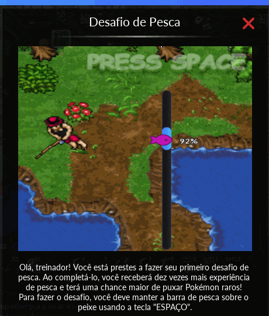

## pesca-a-dor

Automated fishing in [PxG](https://www.pokexgames.com/). 

Features include: `auto fishing`, `cast spells on shiny Pokémon`, `capture shiny Pokémon`, `collect loot`, and `solve minigame` that appears on the screen every ~5 minutes, allowing uninterrupted fishing.

<div align="center">
  


</div>

## Requirements

```bash
pip install pyautogui
pip install keyboard
pip install Pillow
pip install opencv-python
```

## Usage

Set your monitor resolution to `1024x768` for fast and precise screen coordinates.

```python
FISHING_POSITIONS = (280, 382)              # The location where the bait will be cast
MINIGAME_REGION = (160,150,100,400)         # Minigame region
HUNGRY_POSITION = (982,236,17,20)           # Hungry region
IMG_BUBBLE_SIZE = (25, 28)                  # The size of the bubble image
POKEBALL_POSITION = (838, 237)              # The position of the Pokémon's Pokéball
POKE_POSITION = (410, 242)                  # The position where the Pokémon will remain stationary
```

>**Note:** Execute [locateOnScreen.py](https://github.com/felipevzps/pesca-a-dor/blob/main/scripts/locateOnScreen.py) in VSCode to capture coordinates. Hover your mouse over desired locations while the script runs, like Pokémon's pokéball for `POKEBALL_POSITION`.

After adding coordinates to [config.py](https://github.com/felipevzps/pesca-a-dor/blob/main/config.py), run [pesca-a-dor.py](https://github.com/felipevzps/pesca-a-dor/blob/main/pesca-a-dor.py) in VSCode, minimize it, and press `p` in-game to start fishing.


## Ingame hotkeys

```
Start fishing           = NumLock
Use food on pokémon     = Caps
Use medicine on pokémon = Backspace
Stand still             = Tab
Collect loot            = Escape
Use revive              = F1
Order pokémon           = F2
Pokeball for tentacool  = F11
Pokeball for krabby     = F12
```

## Extra

Pesca-a-dor optimizes performance with advanced [multithreading](https://docs.python.org/3.10/library/threading.html#) capabilities.

The `threadKillShiny` manages the `kill_shiny` function, while `threadSomeActions` handles `some_actions`. This parallel approach optimizes the bot's performance, especially when searching for images or executing actions simultaneously, ensuring a more responsive and streamlined experience.

## Versions

- [pesca-a-dor.py](https://github.com/felipevzps/pesca-a-dor/blob/main/pesca-a-dor.py): Shiny Tentacool/Krabby project using a Pokémon with a passive ability (like Electabuzz or Scyther for level 100+). Generates [logs](https://github.com/felipevzps/pesca-a-dor/blob/main/logs/05052023.txt) for events.
- [pesca-a-dor_karp.py](https://github.com/felipevzps/pesca-a-dor/blob/main/pesca-a-dor_karp.py): Shiny Giant Magikarp project and farm Shiny Magikarp fins (a very lucrative source of income).
- [pesca-a-dor_maker.py](https://github.com/felipevzps/pesca-a-dor/blob/main/pesca-a-dor_maker.py): Similar to pesca-a-dor but requires a weaker Pokémon for your maker to fish, such as a Shedinja (level 60+).

## Statistical analysis of shiny occurrences after puzzle resolution

> This game claims that you have a higher chance of fishing shinies after solving the puzzle.
> I decided to test this hypothesis and quantify the probability of shiny occurrences after puzzles.
>
> **Spoiler: Indeed, the shiny rate is higher xD**
>
> The null hypothesis for the [chi-square test](https://en.wikipedia.org/wiki/Chi-squared_test) posits that there is no significant association between the variables being examined, while the alternative hypothesis asserts the presence of a significant relationship.
>
> The chi-square test was employed to assess whether the observed data significantly deviate from what would be expected under the assumption of independence between the variables, providing insights into the association between puzzle resolution and the occurrence of shiny Pokémon.
>
> In this case, the formulated hypotheses are:
> 
> H0: `**There is no association**` between puzzle resolution and the occurrence of shiny Pokémon
> 
> H1: `**There is an association**` between puzzle resolution and the occurrence of shiny Pokémon
>
> Significance level = 0.05


## Contingency Tables

<details>
  <summary>Krabby ~70+ logs (days), more than 500 hours collected</summary>

  |         |  Shiny   | No Shiny |  Total
  |---------|----------|----------|----------
  | After   |   504    |   8541   |   9045
  | Without |   1367   |  85423   |  86790
  | Total   |   1871   |  93964   |  95835
</details>

<details>
  <summary>Tentacool ~70+ logs (days), more than 500 hours collected</summary>

  |         |  Shiny   | No Shiny |  Total
  |---------|----------|----------|----------
  | After   |    48    |   8541   |   8589
  | Without |   246    |  85423   |  85669
  | Total   |   294    |  93964   |  94258
</details>

## Chi-squared Test Results

<details>
  <summary>Krabby</summary>

  - Chi-squared statistic: 681.5909869816392
  
  - P-value: 3.0125967571505313e-150
</details>

> There is enough evidence to reject the null hypothesis for Krabby.
>
> The occurrence of shiny Krabby is not random.
>
> In other words, solving the puzzle is associated with an **increased rate** of shiny Krabby.

<details>
  <summary>Tentacool</summary>
  
  - Chi-squared statistic: 17.670234869403
  - P-value: 2.6270550990164333e-05
</details>

> The occurrence of shiny Tentacool is not random.
>
> In other words, solving the puzzle is associated with an **increased rate** of shiny Tentacool.

## Probability Analysis


- Probability to fish a shiny Krabby after solving a puzzle: `5.5721%`
- Probability to fish a shiny Krabby without a puzzle: `1.5751%`


- Probability to fish a shiny Tentacool after solving a puzzle: `0.5589%`
- Probability to fish a shiny Tentacool without a puzzle: `0.2872%`

## Achievements

```
27/04/2023 - 1st night 100% AFK
04:08 You caught a Pokémon! (Krabby).
04:08 You've wasted: 144 Ultra Balls and 407 Net Balls to catch it.
```

```
23:26 You caught a Pokémon! (Krabby).
23:26 You've wasted: 200 Net Balls to catch it.
```

```
05:47 You caught a Pokémon! (Krabby).
05:47 You've wasted: 20 Net Balls to catch it.
```
```
00:06 You caught a Pokémon! (Krabby).
00:06 You've wasted: 499 Net Balls to catch it.
```
